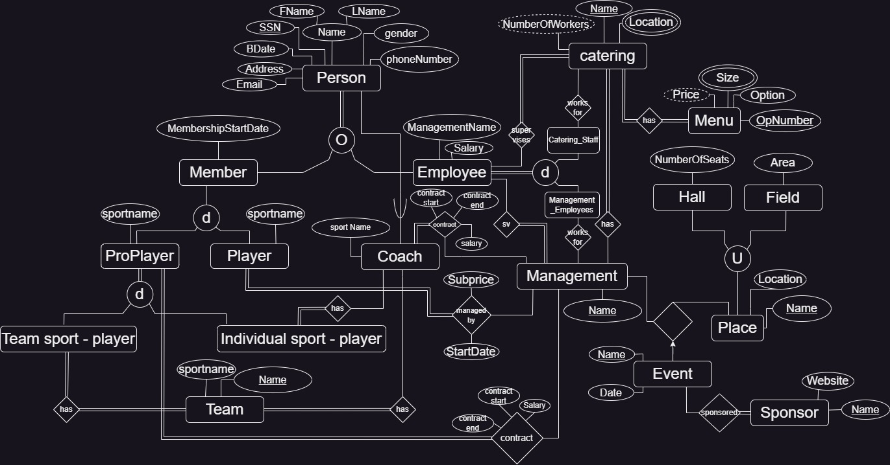
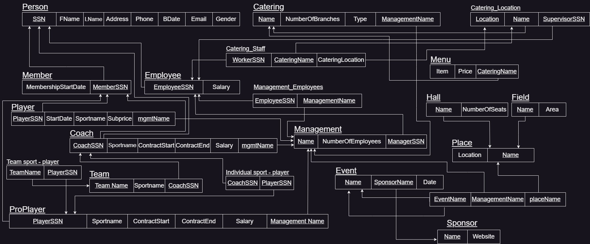

# COMP207 Project: Club Database

## Team Code

### AANSS

## Team Members

- **Ahmed Ashraf** --- [@Alucard0100](https://github.com/Alucard0100)
- **Ahmed Khaled** --- [@a04k](https://github.com/a04k)
- **Noureen Ahmed** --- [@Noureen-Ahmed](https://github.com/Noureen-Ahmed)
- **Seif Mohamed** --- [@sabdelmoniem](https://github.com/sabdelmoniem)
- **Sherif Lotfy** --- [@Sherif-Lotfy](https://github.com/Sherif-Lotfy)

 ## Project Components

  ### Schemas
  ---
-  **EER- Enhanced Entity Relationship**
  

- **RM- Relational Model**
  

- **RM- Relational Model**
  

### Generating the Data for Inserts
---

   Writing and creating data for people manually would have taken a very long time especially when dealing with a whole lot of it so, to save time we built a program that could give insert statements to fill up the tables.


  ```python
import random
import datetime

def genData():
    downtown_streets = ["El Tahrir", "Talaat Harb", "Al Falaky", "26 July St", "Champeleon", "Sherif", "Adly"]
    zamalek_streets = ["Abou El Feda", "Bahgat Ali", "Taha Hussein", "Gezira", "Hassan Sabry", "Shagaret Al Dor", "Hassan Assem", "Ahmed Heshmat", "kamal Al Tawil", "Mohammed Mazhar"]
    imbaba_streets = ["18St. , ElTahrir City", "28St. ,ElTahrir City", "Talaat Harb", "Mamdouh Salem"]
    al_doqi_streets = ["Shaheen", "Gad Eid", "Hassan Ramadan"]
    helopolis_streets = ["Baghdad", "Al Merghany", "Al Ahram", "Al Nozha", "Al Hegaz", "Salah El Din"]
    shobra_streets = ["Shobra St.", "Ahmed Helmy", "Doletyan", "Rod El Farag", "Al Teraa Al Boulakeya", "Kholousi", "Al Khamrawaya", "15 May"]
    salam_streets = ["Gamal Abdel Nasser", "El Sadat"]
    maadi_streets = ["Al Saad Al Aaly","Al Nahda","Damascus","Oraby", "9 St.","Al Kanal","151 St.", "Al Nadi"]
    area = random.choice(['Downtown', 'Zamalek', 'Imbaba', 'Al Doqi', 'Heliopolis', 'Shobra', 'Al-Salam', 'Maadi'])
    street = ""
    random_number = random.randint(1, 100) #for building no 
    if area == 'Downtown':
        street = random.choice(downtown_streets)
        city = 'Cairo'
    elif area == 'Zamalek':
        street = random.choice(zamalek_streets)
        city = 'Cairo'
    elif area == 'Imbaba':
        street = random.choice(imbaba_streets)
        city = 'Giza'
    elif area == 'Al Doqi':
        street = random.choice(al_doqi_streets)
        city = 'Giza'
    elif area == 'Heliopolis':
        street = random.choice(helopolis_streets)
        city = 'Cairo'
    elif area == 'Shobra':
        street = random.choice(shobra_streets)
        city = 'Cairo'
    elif area == 'Al-Salam':
        street = random.choice(salam_streets)
        city = 'Cairo'
    elif area == 'Maadi':
        street = random.choice(maadi_streets)
        city= 'Cairo'
  #name part
    nameM = ["Ahmed","Seif","Sherif","Marawan","Ehab","Kareem","Omar","Amr","Amir","Zeyad","Rashad","Abdallah","Abdelrahman","Ali","Wael","Mohamed","Mahmoud","Yousif","Mostafa","Adham","Ibrahim","Eyad","Abdalaziz","Haytham"]
    nameF = ["Aya","Amal","Amani","Omnya","Arwa","Nour","Rahma","Shahd","Noureen","Mariam","Nada","Esraa","Hager","Nourhan","Yasmin","Yara","Dina","Hana","Salma","Toaa","Eman"]  
    gender = random.choice(['M', 'F'])  
    if gender == 'M':
        first_name = random.choice(nameM)
    else:
        first_name = random.choice(nameF)
  
    L_name = [ "Mohamed","Khaled","Ashraf","Waleed","Emad","Sayed","Yaser","Magdy","Adel","Nader","Sobhi","Hani","Hassan","Farag","Salah","Ghanim","Khalil","Zakaria","Fawzi","Ezzat" ]
    last_name = random.choice(L_name)

    return first_name, last_name , gender , f"{random_number} {street}, {area}, {city}"

    ...

```

  This data generator code can then be edited so we generate data for specific groups, so we could fill up the tables with the data required, and just add all of it into the Person superclass.
  P.S : theres a C++ version of this code too, just not updated though.


 ###  Queries
 ---
 We had plenty of query ideas, seeing that we have a whole lot of tables and data to work with but we settled on the following 22:

``` SQL
-- 1
/*The oldest player in each team*/
select p.fname ,p.lname,t.SportName, t.teamname ,r.ContractStart
from person p , teamsport_player t , pro_player r 
where t.Player_SSN=p.SSN and r.Player_SSN=p.SSN
and r.ContractStart in
(select min(r.ContractStart) 
from teamsport_player t , pro_player r ,person b
where t.Player_SSN=r.Player_SSN and r.Player_SSN=b.SSN
group by t.TeamName);
-- 2
/*the big hall to hold new years concert event*/
select e.Event_Name,e.PlaceName , p.location , v.sponsor_name , v.date
from event_managment_place e , place p , hall h ,event v
where p.PlaceName=e.PlaceName and h.PlaceName=p.PlaceName and v.Name=e.Event_Name
and h.NumberOfSeats=(select max(h.NumberOfSeats) from hall h);
-- 3
/*select catrering that has pizza*/
select * from menu 
where item like"%pizza%";
-- 4
/*the event that will be in the next year*/
select  e.event_name,e.placename, v.date ,v.sponsor_name
from event_managment_place e natural join event v 
where  e.event_name = v.name and v.Date like '%__24%';
-- 5
/*The non pro player member whose membership more than 3 years since 2005*/
select p.fname ,p.lname,p.email,m.MembershipStartDate
from member m , person p 
where p.ssn=m.Member_SSN and 
m.MembershipStartDate between '2005-1-1' and '2008-1-1'
and m.Member_SSN not in (select p.player_ssn , m.player_ssn from pro_player p, player m);
-- 6
/*The catering who have coffee in every branch*/
select m.Catering_Name , m.item , m.price , cl.Location 
from menu m inner  join catering_location cl
on m.Catering_Name = cl.CateringName 
where m.item like"%coffee%";
-- 7
/*add a 10% to salary for every coach who train player in single sport*/
select distinct p.fname,p.lname , c.sportname , c.salary ,
c.salary+0.1*c.salary as 'increased salary' 
from person p , coach c , individualsport_player i
where c.Coach_SSN =p.ssn and c.Coach_SSN=i.Coach_SSN ;
-- 8
/* the employee where its  salary greater than the avg salary for each catering */
SELECT p.fname ,p.lname ,e.salary , c.Catering_Name
from person p, cateringstaff c , employee e
where c.Worker_SSN=p.ssn and p.ssn=e.Employee_SSN 
and e.salary >
(select avg(e.salary) from employee e ,cateringstaff c where c.Worker_SSN=e.Employee_SSN)
order by e.salary desc;
-- 9
/* The number of employees in each managment */
select Management_Name,count(Employee_SSN) as 'no of employees'
from management_employee
group by management_name 
order by management_name asc;
-- 10
/*the paid salaries of employees for each catreing*/
select c.Catering_Name , k.type , sum(e.salary) as paid_salaries
from cateringstaff c,catering k,employee e
where c.Worker_SSN=e.Employee_SSN and c.Catering_Name=k.name 
group by c.Catering_Name 
order by paid_salaries desc;

-- 11
/*the number of pro players for each sport*/
select SportName,count(Player_SSN) as no_of_players from pro_player 
group by SportName
having count(Player_SSN)
order by no_of_players asc;
-- 12
/*The player whose contract end at 2025 and salary more than 40000 */
select p.fname , p.lname , n.contractstart , n.contractend ,n.salary
from person p join pro_player n on n.player_ssn = p.ssn
where n.contractend like '%2025%' and n.salary > 400000;
-- 13
/*The name of manager for each managment*/
select p.fname ,p.lname , m.name from person p , management m
where m.Manager_SSN=p.ssn
group by m.name;
-- 14
/*all catering that has food with chicken*/
select * from menu 
where price between 80 and 150
and item like '%chicken%';
-- 15
/*The details of catering staff who work in more than one branch*/
select p.*  from person p , cateringstaff c 
where p.ssn = c.worker_ssn and c.Catering_Name in 
(select cateringname from catering_location 
group by CateringName having count(*)>1);
-- 16
/*all places that has event or not*/
create view place_event as 
select p.PlaceName, e.Event_Name
from place p left outer join event_managment_place e 
on e.PlaceName=p.placename;
select *from place_event;
-- 17
/*make an order from different caterings*/
select cl.location,m.item ,m.Catering_Name,m.price
from catering_location cl ,menu m
where cl.location='Poolside' and m.Catering_Name=cl.CateringName and m.item='Fresh Juice'
union 
select cl.location ,m.item ,m.Catering_Name,m.price from catering_location cl ,menu m
where  m.Catering_Name=cl.CateringName and m.item ='Fried Shrimp Sandwich' 
union 
select cl.location ,m.item ,m.Catering_Name,m.price from catering_location cl ,menu m
where  m.Catering_Name=cl.CateringName and m.item ='Mushroom Cream Soup'and cl.location= 'Main Club Building' ;
-- 18
/*the events that hold by specific sponsor*/
select e.name , e.date , e.sponsor_name from event e 
where e.Sponsor_Name like'N%';
-- 19
/* number of male players and female players*/
select p.Management_Name,r.gender,count(p.PlayerSSN) as no_of_players
from player p , person r
where p.PlayerSSN=r.ssn
group by r.gender;
-- 20
/*member who lives in talaat harb*/
select p.fname ,p.lname , p.ssn , p.address
from person p  join  member m on m.Member_SSN = p.SSN 
where p.Address like '%Talaat Harb%';
-- 21
/*The details of supervisors for vamos in each branch*/
select p.fname as supervisors , p.ssn , p.phone , cl.cateringname , cl.location as branches
from catering_location cl 
join person p on p.ssn = cl.Supervisor_ssn
where cl.cateringname = 'vamos' ;
-- 22
/*the fields that hold ramadan events*/
select P.Event_name , P.PlaceName
from event_managment_place P
where P.Event_name like "%Ramadan 5on5%";

```
