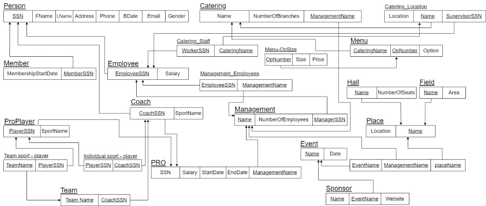
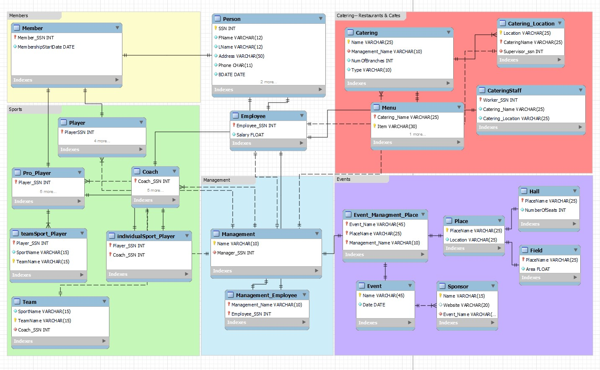

# COMP207 Project: Club Database

## Team Code

### AANSS

## Team Members

- **Ahmed Ashraf** --- [@Alucard0100](https://github.com/Alucard0100)
- **Ahmed Khaled** --- [@a04k](https://github.com/a04k)
- **Noureen Ahmed** --- [@Noureen-Ahmed](https://github.com/Noureen-Ahmed)
- **Seif Mohamed** --- [@sabdelmoniem](https://github.com/sabdelmoniem)
- **Sherif Lotfy** --- [@Sherif-Lotfy](https://github.com/Sherif-Lotfy)

 ## Project Components

  ### Schemas
  ---
-  **EER- Enhanced Entity Relationship**
  

- **RM- Relational Model**
  

- **RM- Relational Model**
  

### Generating the Data for Inserts
---

   Writing and creating data for people manually would have taken a very long time especially when dealing with a whole lot of it so, to save time we built a program that could give insert statements to fill up the tables.


  ```python
import random
import datetime

def genData():
    downtown_streets = ["El Tahrir", "Talaat Harb", "Al Falaky", "26 July St", "Champeleon", "Sherif", "Adly"]
    zamalek_streets = ["Abou El Feda", "Bahgat Ali", "Taha Hussein", "Gezira", "Hassan Sabry", "Shagaret Al Dor", "Hassan Assem", "Ahmed Heshmat", "kamal Al Tawil", "Mohammed Mazhar"]
    imbaba_streets = ["18St. , ElTahrir City", "28St. ,ElTahrir City", "Talaat Harb", "Mamdouh Salem"]
    al_doqi_streets = ["Shaheen", "Gad Eid", "Hassan Ramadan"]
    helopolis_streets = ["Baghdad", "Al Merghany", "Al Ahram", "Al Nozha", "Al Hegaz", "Salah El Din"]
    shobra_streets = ["Shobra St.", "Ahmed Helmy", "Doletyan", "Rod El Farag", "Al Teraa Al Boulakeya", "Kholousi", "Al Khamrawaya", "15 May"]
    salam_streets = ["Gamal Abdel Nasser", "El Sadat"]
    maadi_streets = ["Al Saad Al Aaly","Al Nahda","Damascus","Oraby", "9 St.","Al Kanal","151 St.", "Al Nadi"]
    area = random.choice(['Downtown', 'Zamalek', 'Imbaba', 'Al Doqi', 'Heliopolis', 'Shobra', 'Al-Salam', 'Maadi'])
    street = ""
    random_number = random.randint(1, 100) #for building no 
    if area == 'Downtown':
        street = random.choice(downtown_streets)
        city = 'Cairo'
    elif area == 'Zamalek':
        street = random.choice(zamalek_streets)
        city = 'Cairo'
    elif area == 'Imbaba':
        street = random.choice(imbaba_streets)
        city = 'Giza'
    elif area == 'Al Doqi':
        street = random.choice(al_doqi_streets)
        city = 'Giza'
    elif area == 'Heliopolis':
        street = random.choice(helopolis_streets)
        city = 'Cairo'
    elif area == 'Shobra':
        street = random.choice(shobra_streets)
        city = 'Cairo'
    elif area == 'Al-Salam':
        street = random.choice(salam_streets)
        city = 'Cairo'
    elif area == 'Maadi':
        street = random.choice(maadi_streets)
        city= 'Cairo'
  #name part
    nameM = ["Ahmed","Seif","Sherif","Marawan","Ehab","Kareem","Omar","Amr","Amir","Zeyad","Rashad","Abdallah","Abdelrahman","Ali","Wael","Mohamed","Mahmoud","Yousif","Mostafa","Adham","Ibrahim","Eyad","Abdalaziz","Haytham"]
    nameF = ["Aya","Amal","Amani","Omnya","Arwa","Nour","Rahma","Shahd","Noureen","Mariam","Nada","Esraa","Hager","Nourhan","Yasmin","Yara","Dina","Hana","Salma","Toaa","Eman"]  
    gender = random.choice(['M', 'F'])  
    if gender == 'M':
        first_name = random.choice(nameM)
    else:
        first_name = random.choice(nameF)
  
    L_name = [ "Mohamed","Khaled","Ashraf","Waleed","Emad","Sayed","Yaser","Magdy","Adel","Nader","Sobhi","Hani","Hassan","Farag","Salah","Ghanim","Khalil","Zakaria","Fawzi","Ezzat" ]
    last_name = random.choice(L_name)

    return first_name, last_name , gender , f"{random_number} {street}, {area}, {city}"

    ...

```

  This data generator code can then be edited so we generate data for specific groups, so we could fill up the tables with the data required, and just add all of it into the Person superclass.
  P.S : theres a C++ version of this code too, just not updated though.


 ###  Queries
 ---
 We had plenty of query ideas, seeing that we have a whole lot of tables and data to work with but we settled on the following 20:

``` SQL
-- 
select p.fname ,p.lname,t.SportName, t.teamname ,r.ContractStart
from person p , teamsport_player t , pro_player r 
where t.Player_SSN=p.SSN and r.Player_SSN=p.SSN
and r.ContractStart in
(select min(r.ContractStart) 
from teamsport_player t , pro_player r ,person b
where t.Player_SSN=r.Player_SSN and r.Player_SSN=b.SSN
group by t.TeamName);

select e.Event_Name,e.PlaceName , p.location ,s.name
from event_managment_place e , place p , hall h ,sponsor s
where p.PlaceName=e.PlaceName and h.PlaceName=p.PlaceName and e.Event_Name =s.Event_Name
and h.NumberOfSeats=(select max(h.NumberOfSeats) from hall h);

select* from menu 
where item like"%pizza%";

select e.name as event_name, e.date , s.name as sponser, emp.placename as place_name
from event e 
join sponsor s on  e.name = s.event_name, event_managment_place emp
where e.Date like '%2023%'  and e.name = emp.event_name;

select p.fname ,p.lname,p.email,m.MembershipStartDate
from member m , person p 
where p.ssn=m.Member_SSN and 
m.MembershipStartDate between '2005-1-1' and '2015-1-1'
and m.Member_SSN not in (select player_ssn from pro_player);

select m.Catering_Name , m.item , m.price , cl.Location 
from menu m inner  join catering_location cl
on m.Catering_Name = cl.CateringName 
where m.item like"%coffee%";

select distinct p.fname,p.lname , c.sportname , c.salary ,
c.salary+0.1*c.salary as 'increased salary' 
from person p , coach c , individualsport_player i
where c.Coach_SSN =p.ssn and c.Coach_SSN=i.Coach_SSN ;

SELECT p.fname ,p.lname ,e.salary , c.Catering_Name
from person p, cateringstaff c , employee e
where c.Worker_SSN=p.ssn and p.ssn=e.Employee_SSN and
e.salary>
(select avg(e.salary) from employee e ,cateringstaff c where c.Worker_SSN=e.Employee_SSN)
order by e.salary desc;

select Management_Name,count(Employee_SSN) as 'no of employees'
from management_employee
group by management_name 
order by management_name asc;

select c.Catering_Name , k.type , sum(e.salary) as paid_salaries
from cateringstaff c,catering k,employee e
where c.Worker_SSN=e.Employee_SSN and c.Catering_Name=k.name 
group by c.Catering_Name 
order by paid_salaries desc;

select sportname,count(Player_SSN) as no_of_pro_players from pro_player
group by sportname
having count(Player_SSN)>=10
order by no_of_players asc;

select p.fname , p.lname , n.contractstart , n.contractend ,n.salary
from person p join pro_player n on n.player_ssn = p.ssn
where n.contractend like '%2025%' and n.salary > 400000;

select p.fname ,p.lname , m.name from person p , management m
where m.Manager_SSN=p.ssn
group by m.name;

select * from menu 
where price between 80 and 150
and item like '%chicken%';

select p.*  from person p , cateringstaff c 
where p.ssn = c.worker_ssn and c.Catering_Name in 
(select cateringname from catering_location group by CateringName having count(*)>1);

```
